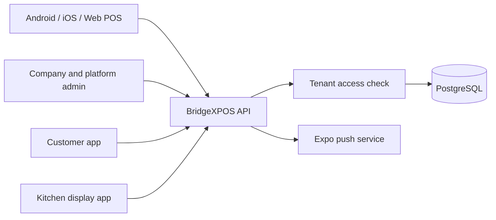

# BridgeXPOS multi-tenant architecture

BridgeXPOS is the platform brand. Reborn Wave Group is tenant one and keeps its existing customer experience while its POS, staffing and operational records receive a `company_id` and `branch_id`.

## Isolation model

Every tenant request uses an authenticated user plus `X-Company-Id`. The API checks `bridge_company_members` before reading or writing company data. Company managers can manage only companies where they have the `owner`, `admin` or `manager` role. Platform administrators are configured with `BRIDGEX_SUPER_ADMIN_EMAILS`.

Operational tables use both company and branch keys. New BridgeXPOS code must always filter by `company_id`; branch filters are added when a role or screen is outlet-specific. A custom domain is resolved through `/api/v1/tenant/resolve`, which exposes branding only for active or trial tenants.

## White-label delivery

Each company stores:

- website domain, app name, logo, icon and theme colours
- Android package name and iOS bundle identifier
- selected industry and optional modules
- subscription plan, monthly/yearly billing, or a one-time commercial agreement

The web client resolves the incoming host and applies the company title, favicon and theme tokens. DNS and TLS terminate at Railway and route to the shared application.

The Expo project uses `mobile/app.config.js`. A build pipeline sets `EXPO_TENANT_SLUG`, `EXPO_PUBLIC_APP_NAME`, `EXPO_PUBLIC_APP_URL`, `EXPO_APP_ICON`, `EXPO_ANDROID_PACKAGE`, `EXPO_IOS_BUNDLE_ID` and a tenant-specific `EXPO_PROJECT_ID`. Each store app therefore has its own identity while calling the shared `/api/v1` backend. App-store accounts, signing certificates and EAS projects remain separate per legal publisher when required by Apple or Google.

## Main services

Module entitlements live in `bridge_company_modules`. Current keys are POS, restaurant, KTV, beauty, booking, inventory, employees, payroll, membership, loyalty, QR ordering, kitchen display, accounting and analytics.

## Staff and notifications

Positions are tenant-defined. Staff profiles hold branch, role, full-time/part-time/contract status, salary/hourly pay and hire date. Customer reviews feed a seven-day leaderboard together with POS sales. Three low reviews or an average below 2.5 marks the employee red for management attention.

Mobile installations register Expo push tokens after sign-in. Meeting creation and customer feedback write an in-app notification record and send a native Android/iOS push. The same service is intended for shift changes, attendance exceptions, leave decisions, low stock, bookings, kitchen orders, loyalty rewards, payroll publication and subscription renewal events. Browser push is deliberately not used.

## Rollout

1. Apply the idempotent schema bootstrap and verify Reborn was assigned as tenant one.
2. Verify Reborn POS totals, attendance and existing users after backfill.
3. Configure the BridgeXPOS platform administrators and first pricing catalogue.
4. Add each customer domain in Railway, then configure DNS.
5. Create a separate Expo project/build profile for each branded store app and provide its store signing credentials.
6. Move remaining legacy operational endpoints behind the tenant access helper before enabling them for any second company.
